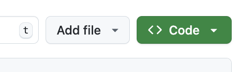
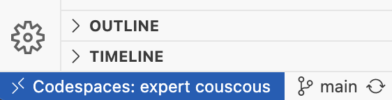
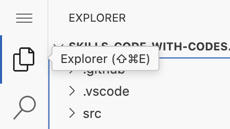

## Step 1: Start a codespace and push some code

### What's the big deal about Codespaces?

A **codespace** is a development environment hosted in the cloud, defined by configuration files in your repository. This creates a repeatable development environment tailored specifically to the project that simplifies developer onboarding and avoids the famous phrase "It works on my machine!" 😎

Each codespace follows the [Dev Container specification](https://containers.dev/implementors/spec/) and is hosted by GitHub as a [Docker container](https://code.visualstudio.com/docs/devcontainers/containers).

But don't worry! You don't need to know Docker or even have it installed on your machine!

> [!TIP]
> Since the Dev Container configuration is part of the repository, you can also use it locally with your own Docker host. Nice!

A Codespace has several advantages/features compared to local development. To name a few:

- Start a codespace directly from the repository page.
- Develop in the browser. No IDE installation required.
  - Option to use a local install of VS Code to link to the remote Codespace.
- Preconfigure everything you need to run the project:
  - Add **[features](https://containers.dev/features)** to install common development needs.
  - Run scripts at various steps of the codespace lifecycle _(e.g install python/npm packages)_.
  - Setup VS Code settings and extensions to match the project needs.
- Fast internet access (since the container is in the datacenter).

> [!TIP]
> Codespaces are even useful in short-lived situations like reviewing a pull request. No need to verify you have the right setup to test out the incoming code changes.

Let's get started! We'll start up a Codespace, run the application, make a change, and push it. Like normal development! 🤓

### ⌨️ Activity: Start a codespace

1. Open a second tab and navigate to this repository. Ensure you are on the **Code** tab.

1. Above the files list on the right, click the green **<> Code** button.

   

1. Select the **Codespaces** tab and click the **Create codespace on main** button. A new window will open running VS Code and it will connect to the remote Codespace. Wait a few minutes for the codespace to be created.

1. Look in the bottom left of the VS Code window see the remote connection.

   

> [!TIP]
> GitHub uses the [universal](https://github.com/devcontainers/images/tree/main/src/universal) Codespace image if the repository doesn't include a configuration. It includes several useful and commonly used tools.

### ⌨️ Activity: Run the application

1. Ensure you are in the VS Code Codespace.

1. In the left sidebar, select the file **Explorer** tab and open the file `src/hello.py`.

   

1. In the lower panel, select the **TERMINAL** tab.

   

1. Paste the following command in the Codespace's remote terminal to show the installed versions of several tools. Note the versions for comparison later.

   ```bash
   node --version
   dotnet --version
   python --version
   gh --version
   ```

1. Paste the following command to run the Python program in the Codespace's remote terminal.

   ```bash
   python src/hello.py
   ```

### ⌨️ Activity: Push changes to your repository from the codespace

1. Replace the `src/hello.py` file contents with the following and save the file.

   ```py
   print("Hello World!")
   ```

1. With the message updated, commit the change and push it to GitHub. Use VS Code's source control tools or the below terminal commands.

   ```bash
   git add 'src/hello.py'
   git commit -m 'fix: incomplete hello message'
   git push
   ```

1. (optional) Back in your web browser, open the `src/hello.py` file to to verify the change was updated.

1. With the the change pushed to GitHub, Mona will begin checking your work. Give her a moment to provide feedback and the next learning steps.
