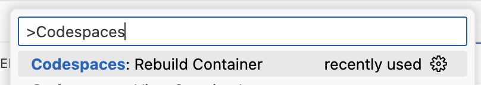

## Step 2: Use a custom image in your codespace

The didn't specify any configuration for the codespace we just created, so GitHub used a default Docker image. While this is very useful, it won't be consistent and it doesn't version lock our runtime environment. Specifying the configuration is important to keep the development environment repeatable.

Let's do that now by providing a specific docker container image.

### How to configure a Codespace?

Configuration is provided directly in the repository via the `.devcontainer/devcontainer.json`. You can even add multiple configurations!

Let's create this file and set a few of the most common settings. For other options like setting configuring VS Code, forwarding ports, and running lifecycle scripts, see the [Codespaces documentation](https://docs.github.com/en/codespaces/setting-up-your-project-for-codespaces) on GitHub.

### ⌨️ Activity: Customize the codespace

1. Ensure you are in the VS Code Codespace.

1. Use the VS Code file explorer to create the configuration file.

   ```txt
   .devcontainer/devcontainer.json
   ```

   Alternately, run the below terminal command to create it.

   ```bash
   mkdir -p .devcontainer
   touch .devcontainer/devcontainer.json
   ```

1. Open the `.devcontainer/devcontainer.json` file and add the following content. Let's start with a basic image.

   ```json
   {
     "name": "Basic Dev Environment",
     "image": "mcr.microsoft.com/devcontainers/base:debian"
   }
   ```

   > 💡 **Tip**: The name is optional but it will help identify the configuration when creating a codespace on GitHub, if there are multiple options.

1. After saving, VS Code likely popped up a notification that it detected a configuration change. You can **Accept** that option to rebuild the development container or manually use the Command Palette (`CTRL`+`Shift`+`P`) and run the command `Codespaces: Rebuild Container`. Select the **Rebuild** option. A full build is not necessary.

   

1. Wait a few minutes for the Codespace to rebuild and VS Code to reconnect.

1. Expand the lower panel and select the **TERMINAL** tab.

1. Use the following command to check the tool versions again. Notice that none are installed now!

   ```bash
   node --version
   dotnet --version
   python --version
   gh --version
   ```

1. ⚠️ There is currently a bug with Codespaces that expects [Git-LFS](https://git-lfs.com/) to be installed. Run the following command to remove the affected Git hooks.

   ```bash
   rm .git/hooks/post-checkout
   rm .git/hooks/post-commit
   rm .git/hooks/post-merge
   rm .git/hooks/pre-push
   ```

1. With our new configuration verified, let's commit the changes. Use VS Code's source control tools or the below terminal command.

   ```bash
   git add '.devcontainer/devcontainer.json'
   git commit -m 'feat: Add codespace configuration'
   git push
   ```

1. With our dev container configuration committed, Mona will begin checking your work. Give her a moment to provide feedback and the next learning steps.
