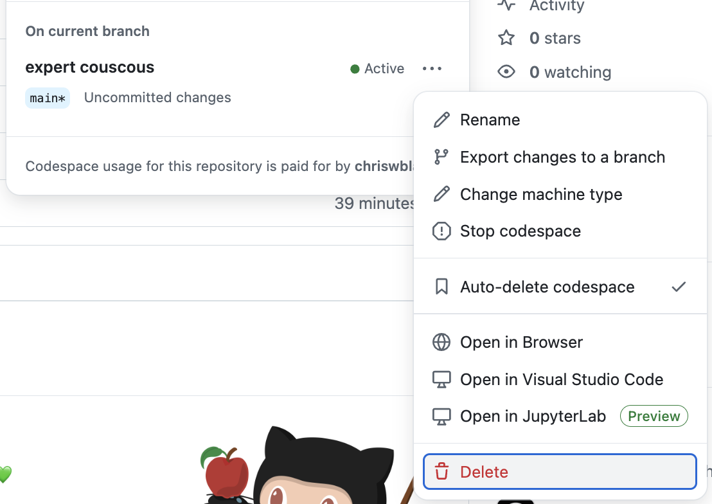

## Step 4: Test out our Codespace

The final test of our Codespace is to put ourselves in the position of an onboarding developer. Let's close everything and start up a new Codespace from nothing.

### ⌨️ Activity: Delete the existing codespace

1. Close the window running your VS Code Codespace.

1. Navigate to your exercise repository.

1. Above the files list on the right, click the green **<> Code** button.

1. Select the **Codespaces** tab to show the list of created Codespaces.

   

1. Find the active entry, select the three dot menu `...`, and select the **Delete** command.

   

> [!TIP]
> You can manage all of your Codespaces across all projects at https://github.com/codespaces

### ⌨️ Activity: Start a codespace

1. Above the files list on the right, click the green **<> Code** button.

1. Select the **Codespaces** tab and click the **plus sign** `+` or **Create codespace on main** button.

   > Alternately you can select the three dot menu `...` to choose a different machine type, location, or configuration.

1. Wait a few minutes for the Codespace to be created and VS Code to connect.

1. (optional) Test out some of the activities from the previous steps to see if they still work!

1. Add an issue comment to let Mona know you finished this activity, then give her a moment to share the final review.

   ```md
   Hey @professortocat, I've finished testing out my new Codespace.
   I'm ready to review!
   ```

1. Nice work! You are all done! 🎉
